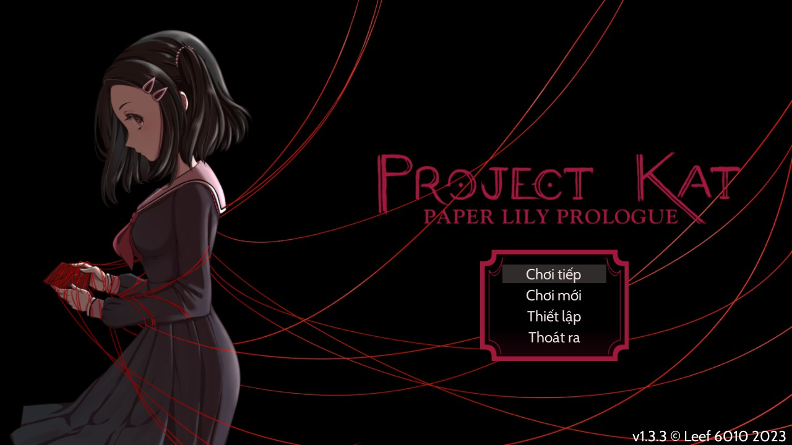
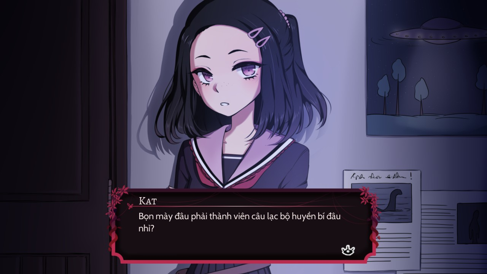
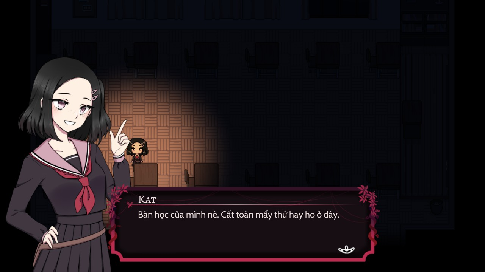
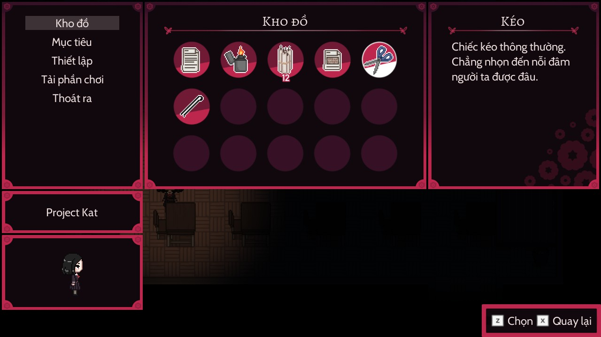
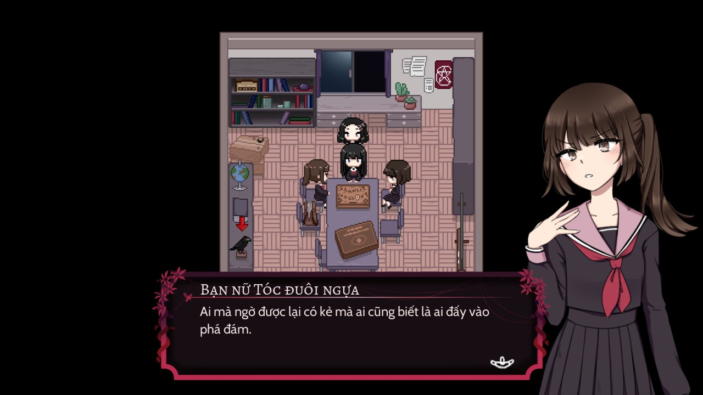

# Phiên bổn Diệc quế cho Project Kat - Paper Lily Prologue

Chỉ đặng xài dới v1.3.3, dì phiên bổn mới nhứt đả chèn tiếng Bắc Kỳ dô.

## Chổ tải game chánh thức: Chưa cọ

## Cách xuấc file PCK
- Để 2 phừn mềm `godot.exe` dà `godotpcktool.exe` dô thư mục ni
- Chạy `godot.exe`, mở file `project.godot`, mở mục "Editor -> Manage Export Templates" rầu nhứn "Download and Install"
- Nhứn file `Export PCK.bat`, chương trình sẻ tạo file PCK dới tên `translation_vi.pck` dô chổ ni, rầu tự kéo dô mục "pack" cụa trò nhởi

## Phông chử đặng xài:
- [Alegreya SC](https://fonts.google.com/specimen/Alegreya+SC) (Tiêu đề của item)
- [Cabin](https://fonts.google.com/specimen/Cabin) (Mặc định)
- [SVN-Progs](https://www.svnfont.com/viet-hoa-svn-progs/) (Văn bản kinh dị)
### Hình vẻ
- [Segoe Print](https://learn.microsoft.com/vi-vn/typography/font-list/segoe-print) (Instruction 1)
- SVN-Segoe Print (Instruction 1)
- iCiel Be Cool (Instruction 2)

## Hình coi trước

